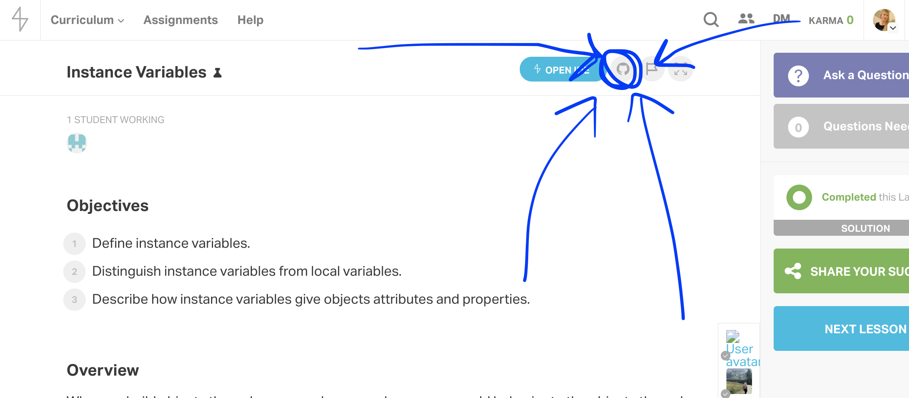
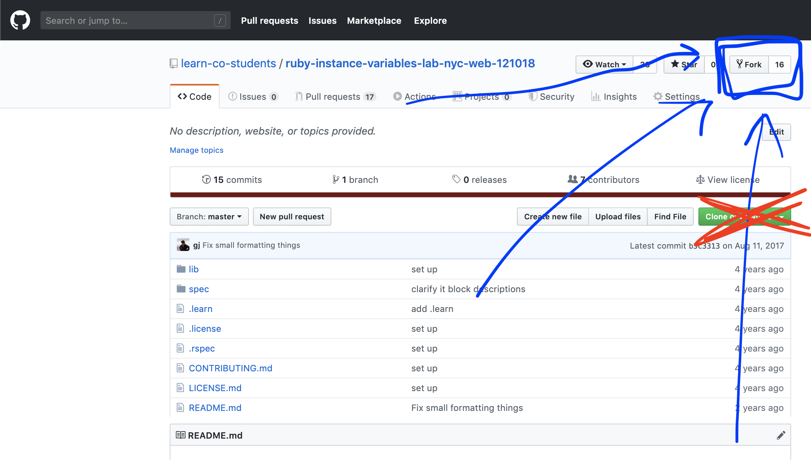
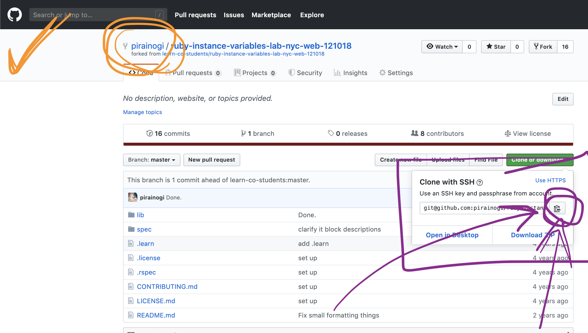
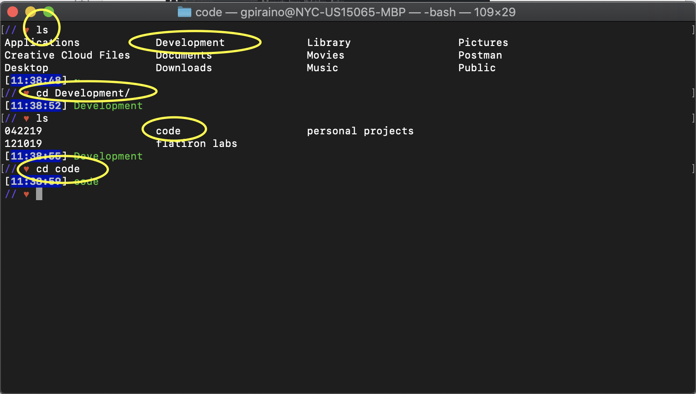
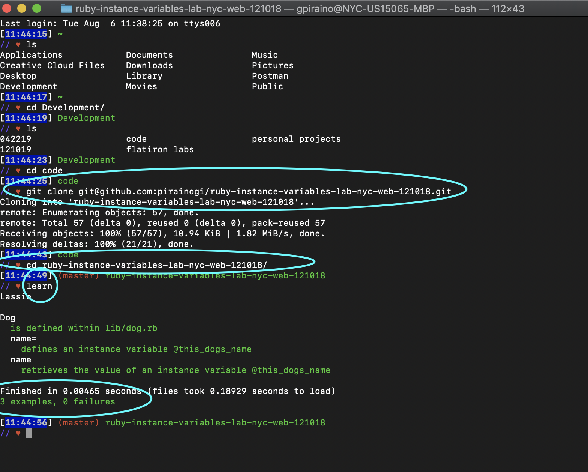

# Fork And Clone Instructions!

👋👋👋 and WELCOME to Flatiron!

Below are the instructions on how to fork and clone a lab. Reference this document as you're getting used to the terminal/text editor environment!

So you've come to a lab in learn - woohoo!

The first thing you should do is READ THE README.

The next thing you should do is... make sure you READ THE README!

Once you've done that, hit this little github symbol - nice!



This will bring you to the lab repository in Github. Do not clone from this page! You need to FORK this lab - this will create a repository under your account with the lab.

Click on this FORK button in the top right.



This will bring you to the forked version of the lab. If you see your username in front of the lab name, you are in the correct place!



If you are opening up a fresh window in terminal, I would highly suggest the following:
1. ```pwd``` to PRINT WORKING DIRECTORY. This will tell you where you are in your file tree.
2. ```ls ``` to LIST the documents in your folder. This will tell you what lives in the current folder that you're in.
3. ```cd``` into ```Development```. (pro tip: you should be able to type ```cd dev``` and hit tab and it should autocomplete for you)
4. ```ls``` again to see what folders you have inside of ```Development```. You should have a folder called ```code```!
5. ```cd``` into ```code```.



NOW! when you're in your ```code``` folder:

On the forked version of the lab, click on the GREEN CLONE button.

The copy button (circled in purple below) will copy the path. Make sure that you see "Clone with SSH". If you instead see "Clone with HTTPS", click on the blue link above the copy button that says "Use SSH".


Back in terminal - type ```git clone``` and cmd + v to paste the path. This will clone the lab.

When the lab has been cloned, you need to ```cd``` into the newly created folder.

NOW you can run ```learn```!



If you see an error message saying that you cannot run ```learn```, you should run ```bundle install``` and try running ```learn``` again!
